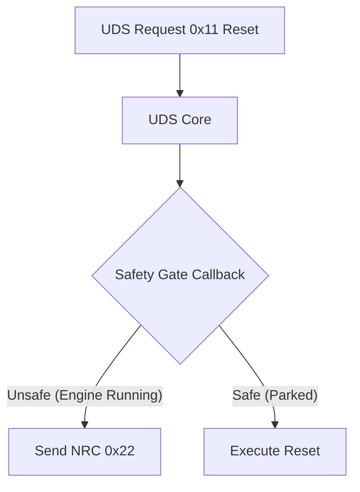

Mechanics use Unified Diagnostic Services (UDS) to talk to cars. It's how they read fault codes, update firmware, and recalibrate sensors.

But UDS has a dark side. A bad implementation lets a laptop reset an ECU while the vehicle is doing 70 mph on the highway.

I built **UDSLib** to stop that. It doesn't just implement the standard; it enforces **safety by design**.

> **Source Code**: [github.com/w1ne/udslib](https://github.com/w1ne/udslib)

# The "Safety Gate" Architecture

The biggest change in `UDSLib` is the **Safety Gate**.

Most stacks call the service handler (like "ECU Reset") immediately. You have to remember to check "is the engine running?" inside that handler. If you forget, you have a safety violation.

`UDSLib` flips this.

## Centralized Safety arbitration

Before the stack runs *any* dangerous command, it hits the Gate.

You write one function: `fn_is_safe()`. If it returns `false`, the stack says no (NRC 0x22). You can't bypass the safety check by forgetting a line of code in a new handler. The stack forces it.

# ISO-14229-1 Compliance & NRC Priority

Getting the error codes right is hard. The standard has a strict **Negative Response Code (NRC) Priority**. If a request is wrong for two reasons (e.g., wrong length AND security locked), you must return the specific error code the standard demands. If you don't, hackers can map your system state.

`UDSLib` uses a table-driven dispatcher that follows the rules strictly:
1.  **0x7F**: Service Not Supported
2.  **0x12**: SubFunction Not Supported
3.  **0x13**: Incorrect Message Length
4.  **0x33**: Security Access Denied
5.  **0x22**: Conditions Not Correct (The Safety Gate)

# Spliced Transport Layer: Zephyr vs Bare Metal

UDS rides on ISO-TP (ISO 15765-2), which handles breaking large messages into CAN frames.

`UDSLib` uses a **Spliced Transport Architecture**:
*   **Native Mode**: On **Zephyr**, it uses the kernel's native ISO-TP sockets. This saves RAM and CPU.
*   **Fallback Mode**: On **Bare Metal**, it uses its own static buffers. It handles **CAN-FD** too.

# Tooling Ecosystem

You can't fix what you can't see. I built tools to help me debug it:

*   **Wireshark Dissector**: A LUA script that decodes traffic, showing you exactly which service logic is executing.
*   **HTML Dashboard**: A log analyzer that generates a visual timeline of the session. It highlights P2 timer violations and security changes instantly.
*   **Python Bindings**: I wrapped the C library with `ctypes`, so I can fuzz-test the parser with thousands of malformed packets from a script.

# Conclusion

Safety in automotive firmware isn't just about code quality. It's about architecture. By enforcing centralized safety checks and strict state validation, `UDSLib` protects the vehicle from both malicious attacks and developer error.
